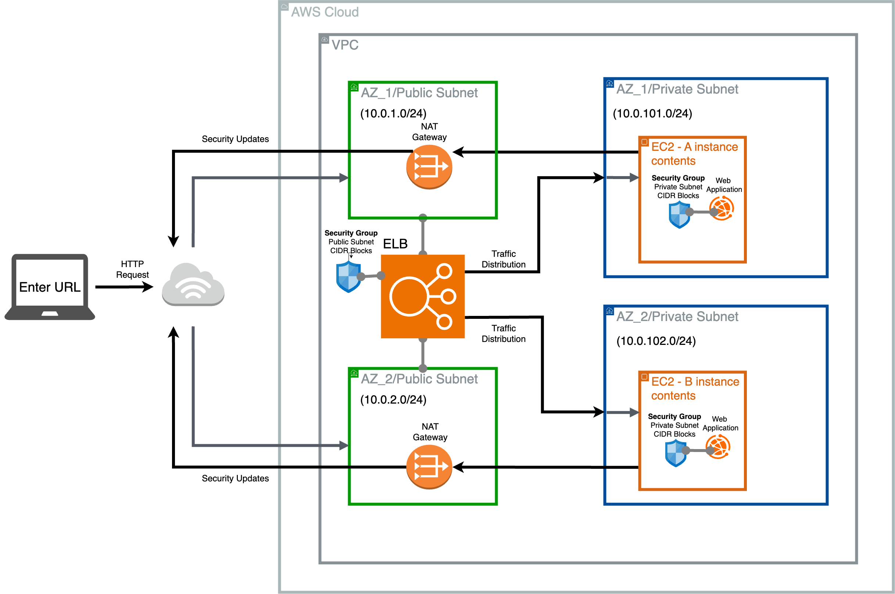

# Cloud Projects
A portfolio of cloud projects using Infrastructure as Code (IaC)
Herein is a terse description of the activity undertaken in each project and the corresponding method of what was done on the CLI.
Project titles here are virtually identical to their corresponding repository folders.

*Architectural diagram were created using draw.io.*

## Project 1: Learn Terraform Docker Container

### Activity
1. Install terraform
2. Verify the installation
3. Enable tab autocompletion
4. Provision and destroy an NGINX server

---
### Method
1. `brew tap hashicorp/tap` -> `brew tap hashicorp/tap` -> `brew install hashicorp/tap/terraform` -> `brew update` -> `brew upgrade hashicorp/tap/terraform`
2. terraform --help
3. `terraform -install-autocomplete`
4. Start docker -> `open -a Docker`
   - create the `main.tf` inside the relevant folder (earn-terraform-docker-container)
   - terraform init
   - terraform apply
   - check the container -> `docker ps`
   - `terraform destroy`
   
---

## Project 2: Learn Terraform AWS Instance (learn-terraform-aws-instance)

### Activity
1. Spin up a Debian EC2 instance
2. Replace the Debian instance with an Ubuntu instance which is dynamically chosen to be the latest version
3. Destroy the Ubuntu EC2 instance

---
### Method
1. `terraform init` -> `terraform fmt` -> `terraform validate` -> `terraform apply`
   - Inspect the state of the EC2 instance -> `terraform show`
   - List resources in the project's state -> `terraform state list`
2. Add a data block to filter for the latest Ubuntu AMI
3. `terraform destroy`

---

## Project 3: Define Input Variables (learn-terraform-aws-instance)

### Activity
1. Create variables.tf file to define EC2 instance name dynamically
2. Change instance name whilst provisioning the EC2 instance

---
### Method
1. `touch variables.tf`
2. `terraform apply -var "instance_name=YetAnotherName"`

---

## Project 4: Query data with outputs (learn-terraform-aws-instance)

### Purpose
To be able to use these outputs to connect this component of infrastructure with other components of infrastructure e.g. Amazon S3.

### Activity
1. Create outputs.tf file to define the output EC2 instance configuration
2. Query the outputs

---
### Method
1. `touch outputs.tf`
2. `terraform output`

---

## Project 5: Store Remote State

### Purpose
To use HCP Terraform to keep the infrastructure state secure and encrypted in a place that collaborators can access and where Terraform can run remotely.

### Activity
1. Login to terraform
2. Having logged in, initialise terraform
3. Migrate the state file
4. Having migrated the state file to HCP Terraform, delete the local state file
5. Set workspace variables in HCP Terraform 

---
### Method
1. `terraform login`
2. `terraform init`
3. `terraform init`
4. `rm terraform.tfstate`
5. Login to HCP Terraform to do this

---

## Project 6: Defining Infrastructure with Terraform Resources

### Purpose
Creating an EC2 instance for a (PHP) web app with an AWS security group that enables public accessiblity via the internet.

### Activity
1. Changed the EC2 instance to Amazon Linux 2023
2. Created a new init_script_amazon_2023.sh script to work with the new AMI
3. Created an Amazon Security Group that enables access to the EC2 webserver
4. Added vpc_security_group_ids to the aws_instance resource
5. Launched the instance

---
### Method
1. Obtained from Amazon management console -> AMI catalog
2. Modified the original init_script.sh script accordingly
3. Added a new resource for security group providing info on ingress and egress including from_port, to_port, protocol and cidr_blocks which enable the public accessibility
4. A list was added as such `vpc_security_group_ids = [aws_security_group.web-sg.id]`
5. `terraform login` -> `terraform fmt` -> `terraform validate` -> `terraform init` -> `terraform apply`

---

## Project 7: Building a highly available EC2 with an ELB

### Purpose
Deploying a web app using an EC2 and a load balancer to handle traffic. Both private and public subnets will be used to house the EC2 and load balancer respectively. And all components will be kept in a virtual private cloud for logistic isolation and enhanced security.

### Activity
1. Configured filtration for available AZs with a data block
2. Configured a VPC module with 2 private subnets and 2 public subnets, and NAT gateway toggleable VPN gateway
3. Configured app security groups
4. Configured loading balancer security groups
5. Configured a resource for loading balancer ID
6. Configured a module for the Elastic Loading Balancer (ELB) with associated LB security group and housed in a public subnet, detailing the instances in the target group, the listener setup of the LB and the health check settings for the instances and tags for the LB.
7. Configured a module for the EC2 instances detailing the type of instance and the number of them, housing in two private subnets, associated security groups and tags for the EC2s.
8. Created a terraform variable file and added several variables including, aws_regions, vpc_cidr_block, instance_count, enable_vpn_gateway, public_subnet_count, private_subnet_count, public_subnet_cidr_blocks, private_subnet_cidr_blocks, resource_tags and ec2_instance_type.
9. Added the variables
10. Configured settings for Terraform Cloud
11. Configured and output terraform file
12. Created .auto.tfvars file to edit the resource tags and modify the number instances

---
### Method
1. Added code to main.tf
2. Added code to main.tf
3. Added code to main.tf
4. Added code to main.tf
5. Added code to main.tf
6. Added code to main.tf
7. Added code to main.tf
9. `touch variables.tf` -> Added code for all variables
10. `touch terraform.tf` -> Added terraform block with details workspace, owner and API provider
11. `touch output.tf` -> Added code to output public DNS name
12. `touch terraform.auto.tfvars` -> Added code

---

## Project 8: Building a highly available Web application with an ELB and a database

### Purpose
Deploying a web app using an EC2 and a load balancer to handle traffic. Both private and public subnets will be used to house the EC2 and load balancer respectively. And all components will be kept in a virtual private cloud for logistic isolation and enhanced security.

### Activity
Building on the tasks completed in "learn-terraform-variables"
1. Define a database resource in main.tf
2. Declare variables for database username and password and mark them as sensitive
3. Create a file to be parsed that stores the database username and password
4. Add an output block for database details in the output.tf file, include the database address, database username and database password
5. Build infrastructure 

---
### Method
1. Added code to main.tf
2. Added code to variables.tf
3. `touch secret.tfvars`
4. Added code to output.tf
5. `terraform init` -> `terraform apply -var-file=secret.tfvars`

### Reflection
- Updating the `output.tf` file with database information is a way to gather the info required to gain access to the database to update, modify or query the database.
- The security of this infrastructure could be improved with a number of changes including changing the ELB port to 443 and the protocol to HTTPS, doing this in turn requires a SSL/TLS certificate (which is called an AWS Certificate Manager [ACM] within AWS Cloud Infrastructure), and this in turn requires a domain which I don't have access to so I did not provision this superior security setting.
- The ingress traffic to the ELB could be limited via the ELB security group. It currently allows all traffic, but if it were an internally used app it could be limited to specific IPs that are trusted such as known internal IPs or a range VPN IPs.
- At a high layer above the ingress traffic, an AWS WAF could be used to block IPs based on reputation, region/country (e.g. Russia), rate (to prevent DDoS) and the pattern of request (to prevent SQL injections)

---